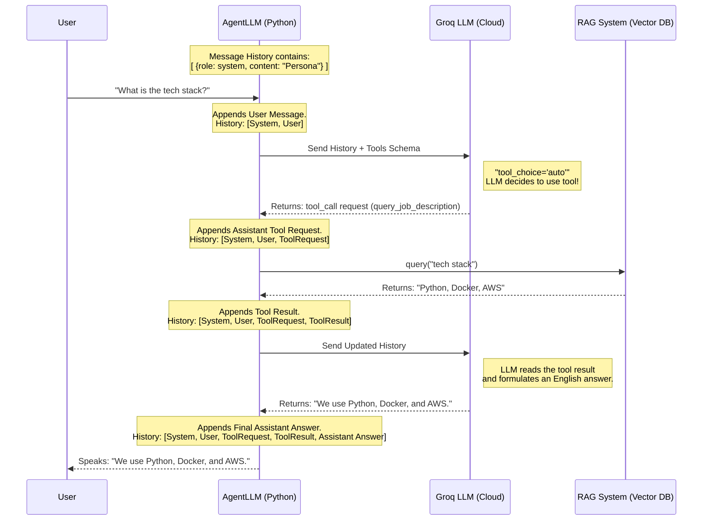

# Agent LLM Architecture Flowchart

Below is the Mermaid flowchart illustrating exactly how `agent_llm.py` handles a user request step-by-step.

```mermaid
sequenceDiagram
    participant User
    participant AgentLLM (Python)
    participant Groq LLM (Cloud)
    participant RAG System (Vector DB)
    
    Note over AgentLLM (Python): Message History contains:<br>[ {role: system, content: "Persona"} ]
    
    User->>AgentLLM (Python): "What is the tech stack?"
    
    Note over AgentLLM (Python): Appends User Message.<br>History: [System, User]
    
    AgentLLM (Python)->>Groq LLM (Cloud): Send History + Tools Schema
    Note right of Groq LLM (Cloud): "tool_choice='auto'"<br>LLM decides to use tool!
    
    Groq LLM (Cloud)-->>AgentLLM (Python): Returns: tool_call request (query_job_description)
    
    Note over AgentLLM (Python): Appends Assistant Tool Request.<br>History: [System, User, ToolRequest]
    
    AgentLLM (Python)->>RAG System (Vector DB): query("tech stack")
    RAG System (Vector DB)-->>AgentLLM (Python): Returns: "Python, Docker, AWS"
    
    Note over AgentLLM (Python): Appends Tool Result.<br>History: [System, User, ToolRequest, ToolResult]
    
    AgentLLM (Python)->>Groq LLM (Cloud): Send Updated History
    Note right of Groq LLM (Cloud): LLM reads the tool result<br>and formulates an English answer.
    
    Groq LLM (Cloud)-->>AgentLLM (Python): Returns: "We use Python, Docker, and AWS."
    
    Note over AgentLLM (Python): Appends Final Assistant Answer.<br>History: [System, User, ToolRequest, ToolResult, Assistant Answer]
    
    AgentLLM (Python)-->>User: Speaks: "We use Python, Docker, and AWS."
```
